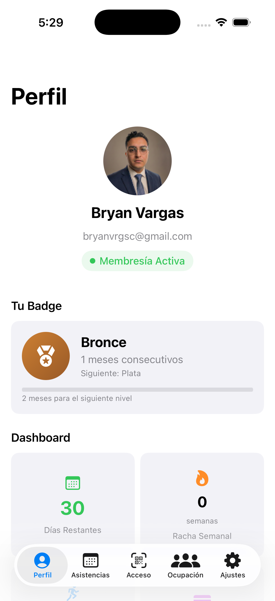
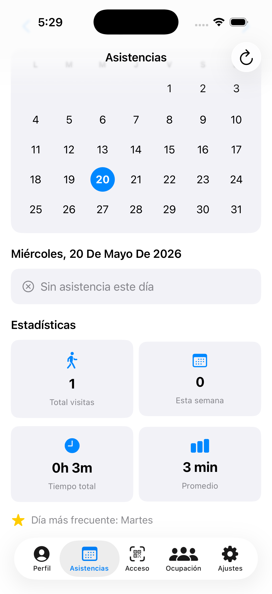
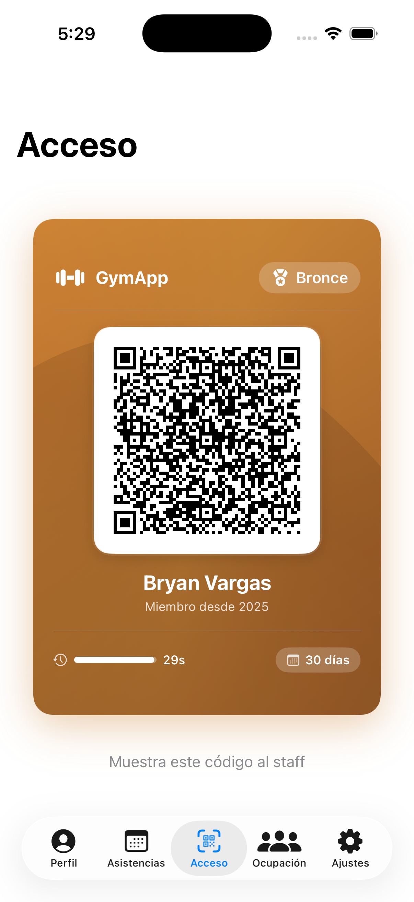
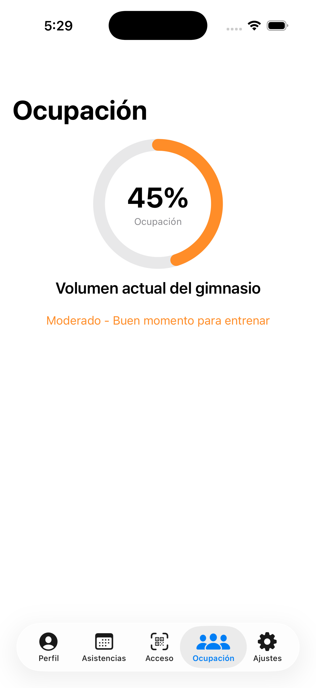
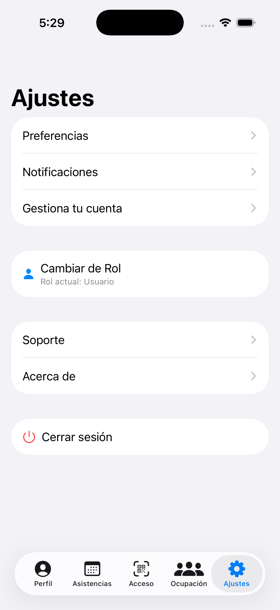
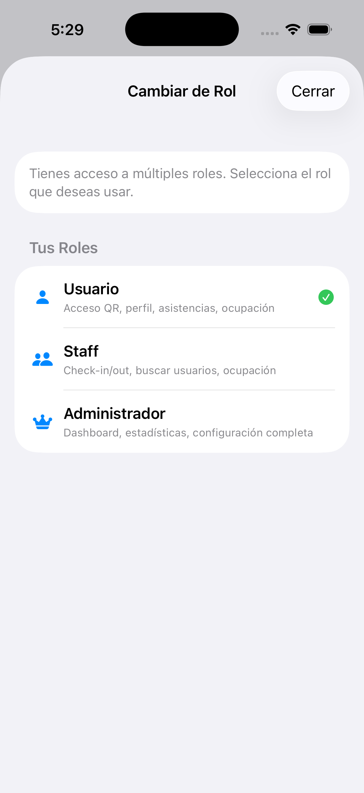

# GymApp iOS

Aplicación para iOS que permite a los usuarios registrados de un gimnasio acceder a su perfil, información de membresía y servicios disponibles según su suscripción activa.

---

## 📸 Screenshots

<p align="center">
  
  
  
  
  
</p>
<p align="center">
  
</p>

---

## 📱 Características
- **Autenticación segura** con Auth0.
- **Perfil de usuario**:
  - Foto de perfil
  - Nombre completo y correo
  - Estado de membresía (Activa / Expirada)
  - Fecha de expiración
  - Botón para renovar membresía
- **Visualización de servicios del gimnasio** según la suscripción activa.
- **Flujo de UI moderno** con SwiftUI y Combine.

---

## ⚙️ Tecnologías
- **Swift 5+**
- **SwiftUI**: para interfaces declarativas
- **Combine**: para manejo reactivo de datos
- **Firebase**: autenticación, Firestore, y tracking de asistencias
- **Xcode 15+**

---

## 🛠 Instalación
1. Clonar el repositorio:
```bash
git clone https://github.com/tu-usuario/GymApp-iOS.git
cd GymApp-iOS
```
2.	Abrir el proyecto en Xcode:
```bash
open GymApp.xcodeproj
```
3.	Configurar Auth0:
	•	Crear una aplicación en Auth0.
	•	Configurar Auth0ClientId y Auth0Domain en el archivo de configuración de tu proyecto.
4.	Ejecutar en simulador o dispositivo.

## 🚀 Uso
	•	Inicia sesión con tu cuenta de usuario.
	•	Accede al perfil para ver tu estado de membresía.
	•	Consulta los servicios y rutinas disponibles según tu suscripción.
	•	Actualiza tu membresía desde la app si está próxima a expirar.

## 📝 Estructura del proyecto
```bash
GymApp/
│
├─ Views/          # Vistas SwiftUI
├─ ViewModels/     # Lógica de negocio y Combine
├─ Models/         # Modelos de datos
├─ Services/       # Servicios externos (Auth0, API)
└─ Resources/      # Assets y configuraciones
```
## 🤝 Contribución
1.	Hacer fork del proyecto.
2.	Crear una nueva rama: git checkout -b feature/nueva-funcionalidad
3.	Realizar cambios y commitear: git commit -m "Agrega nueva funcionalidad"
4.	Push a la rama: git push origin feature/nueva-funcionalidad
5.	Abrir un Pull Request.
